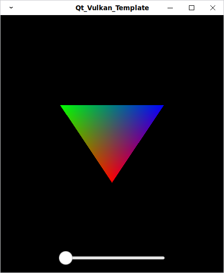
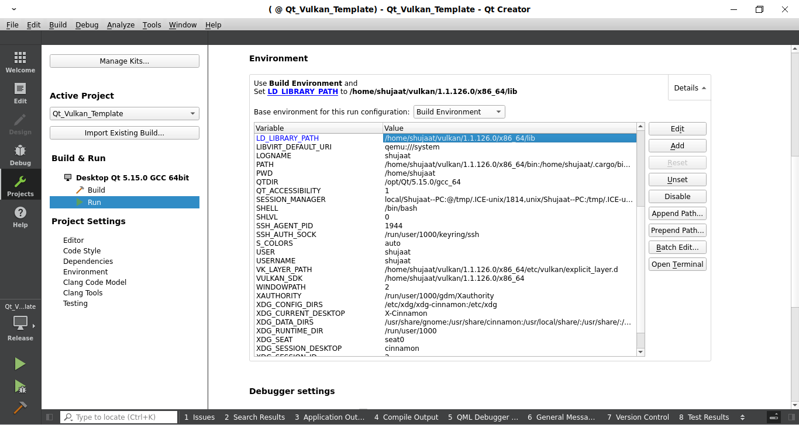
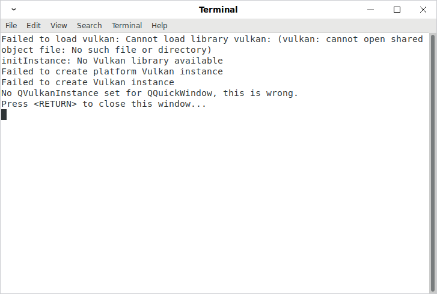

# Qt Vulkan Template
Drawing triangle using Vulkan in Qt Quick Scene Graph.

## Build
I have tested both `Qt_Vulkan_Template.pro` and `CMakeLists.txt` in QtCreator-4.12.4 using Vulkan-1.1.126.0, Qt5.15.0 on Ubuntu-18.04.

Running `Qt_Vulkan_Template` using `Qt_Vulkan_Template.pro` in QtCreator is straightforward, just open it in QtCreator, modify the vulkan sdk path in the .pro file and then run it. That's it. 

However running it using `CMakeLists.txt` requires adding `LD_LIBRARY_PATH` in `QtCreator->Projects->Run->Environment`, see the first screenshot below to learn where to add it. Adding `LD_LIBRARY_PATH` is required as though without it the project compiles without any issue but it throws an error at the startup. That error is shown in the following second screenshot:

